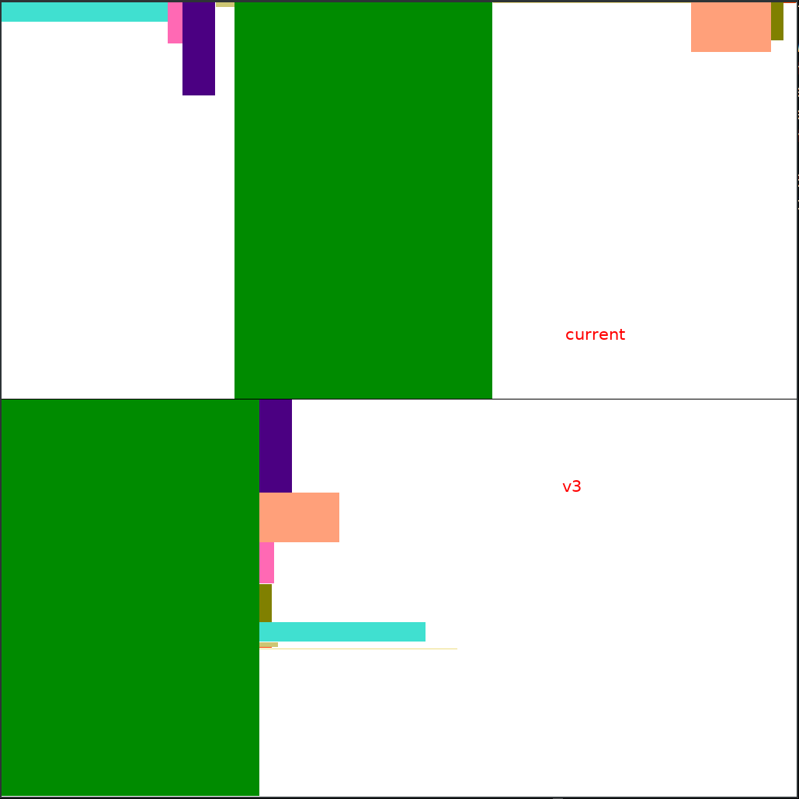

# Halo2 Layouter v3 with advice column merging

This is a script to test a simple layouting algorithm that merges advice
columns tested on the zkevm-circuits.  The zkevm-circuits has 1 region per
subcircuit, and the number of rows per subcircuit is determined by a worst-case
gas/row analysis.  This way we get a supercircuit that can prove the target gas
in the worst case.

# Results



```
k = 26, max_gas = 741534.0

= Current =

[Region(name='evm', width=131, height=3336903, x=0, y=0), Region(name='bytecode', width=12, height=7022326, x=131, y=0), Region(name='copy', width=26, height=15794674, x=143, y=0), Region(name='exp', width=15, height=808272, x=169, y=0), Region(name='keccak', width=203, height=67108827, x=184, y=0), Region(name='mpt', width=156, height=140891, x=387, y=0), Region(name='rw', width=63, height=8401580, x=543, y=0), Region(name='tx', width=10, height=6473591, x=606, y=0), Region(name='pi', width=10, height=244706, x=616, y=0)]

advice = 626, fixed = 65
Mem estimation: 22240 GiB

= V3 =

[Region(name='keccak', width=203, height=67108827, x=0, y=0), Region(name='copy', width=26, height=15794674, x=203, y=0), Region(name='rw', width=63, height=8401580, x=203, y=15794674), Region(name='bytecode', width=12, height=7022326, x=203, y=24196254), Region(name='tx', width=10, height=6473591, x=203, y=31218580), Region(name='evm', width=131, height=3336903, x=203, y=37692171), Region(name='exp', width=15, height=808272, x=203, y=41029074), Region(name='pi', width=10, height=244706, x=203, y=41837346), Region(name='mpt', width=156, height=140891, x=203, y=42082052)]

advice = 359, fixed = 65
Mem estimation: 13696 GiB
```

# Python dependencies
- `pygame` for drawing the layout result

# Usage
```
./zkevm-worst-case.py
```
